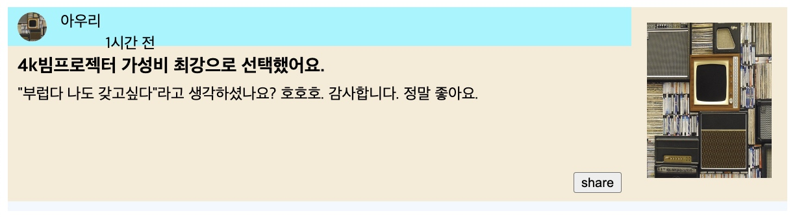
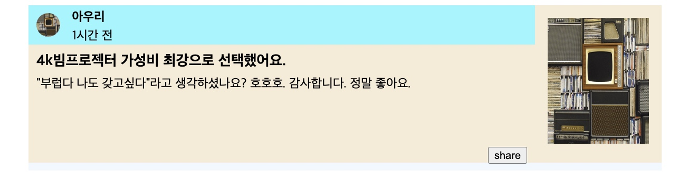

date: Feb 19, 2023

# float
`layout1`
붕 띄워서 내가 원하는 곳으로. 
float로 만들어진 행에서 다른 행으로 넘어갈 땐 clear 해줘야함. 
# inline-block, block
`layout2`
display:block // 한 행을 전부 차지
display: inline-block // 내 크기만큼 차지
# 실습
## 목표: 

## TODO 구현하며 생긴 궁금증
- [ ] margin은 상속되는게 아닌가? 
    - margin: 10%; 의 기준은 어디지?
- [ ] margin혹은 padding을 적용할 때 왜 지정한 box의 크기가 늘어날까?
- [ ] child가 부모 내에만 존재하도록 둘 수는 없나? (존재하는 영역이 부모 내에 들어가도록)
- inline혹은 float만을 사용하여 column은 어떻게 구현할까? (아우리 / 1시간 전)
    - 해당 부분을 div내에 묶고, img와 div각각에 float를 준다. 

## 내꺼
[layout-hw.html](assets/layout-hw-1.html)
[layout-hw.css](assets/layout-hw-1.css)

## 쌤꺼보고 수정. 

[layout-hw.css](assets/layout-hw-2.css)
[layout-hw.css](assets/layout-hw.html)

### 알게된것:
- float하면 `다음에 오는 요소`에 clear:both해줘야한다. 